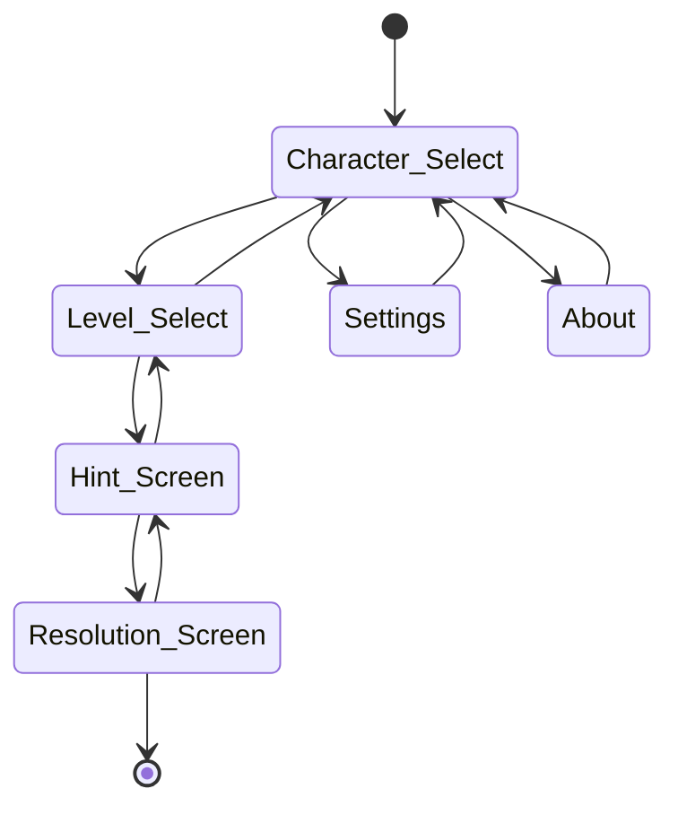

# Emerald App

La aplicación ofrece al usuario una forma rápida de encontrar los fragmentos de esmeraldas para los niveles de Knuckles y Rouge en Sonic Adventure 2 a travéz de las pistas que entrega el juego excluyendo la versión de dreamcast ya que usa pistas distintas.

## Authors

- [@Remixpak](https://github.com/Remixpak)

## Features

- La app debe permitir al usuario el personaje con el cual jugará.
- La app debe permitir al usuario el nivel que jugará.
- La app debe entregar una solución con al menos una pista (puede ser más de ua solución si no se especifican las otras pistas).
- La app debe permitir al usuario ingresar o tomar una foto del lugar en el que encontró el fragmento de esmeralda.
- La app debe contar con una pantalla de información que detalle las versiones del juego que son compatibles.
- La app debe reproducir sonidos característicos de los personajes al seleccionarlo
- La app debe permitir al usuario poner canciones del juegos si es que lo prefiere

