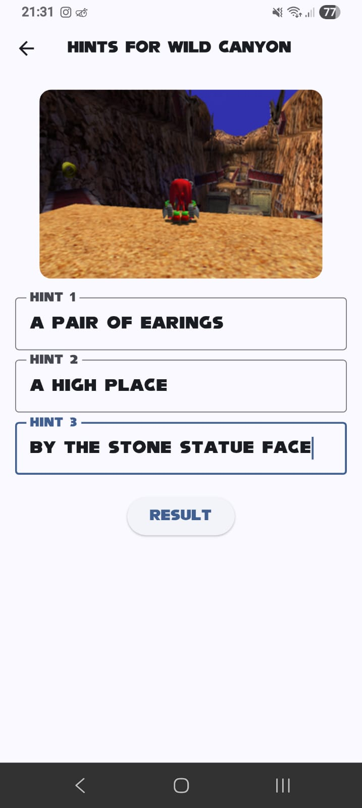
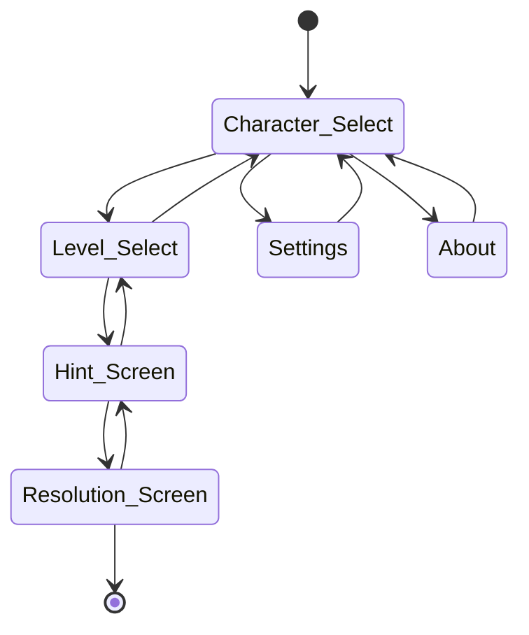

# Emerald App

La aplicación ofrece al usuario una forma rápida de encontrar los fragmentos de esmeraldas para los niveles de Knuckles y Rouge en Sonic Adventure 2 a travéz de las pistas que entrega el juego excluyendo la versión de dreamcast ya que usa pistas distintas.

## Authors

- [@Remixpak](https://github.com/Remixpak)

## Features

- La app debe permitir al usuario seleccionar el personaje con el cual jugará.
- La app debe permitir al usuario seleccionar el nivel que jugará.
- La app debe permitir al usuario ingresar o tomar una foto del lugar en el que encontró el fragmento de esmeralda.
- La app debe contar con una pantalla de información que detalle las versiones del juego que son compatibles.
- La app debe permitir al usuario poner canciones del juegos si es que lo prefiere.

## User preferences & persistence

- Las preferencias del usuario se almacenan localmente para mantener su configuración entre sesiones.
- La app permite desactivar la música de fondo.
- permite reproducir 1 canción o las 3 disponibles en bucle.
- permite al usuario seleccionar que canción reproducir.

## ScreenShots

)
)
)
)
)

## Screen_Navegation

```mermaid
stateDiagram-v2
    [*] --> Character_Select
    Character_Select --> Level_Select
    Character_Select --> Settings
    Settings --> Character_Select
    Character_Select --> About
    About --> Character_Select
    Level_Select --> Hint_Screen
    Level_Select --> Character_Select
    Hint_Screen --> Resolution_Screen 
    Hint_Screen --> Level_Select
    Resolution_Screen --> Hint_Screen
    Resolution_Screen --> [*]
```
